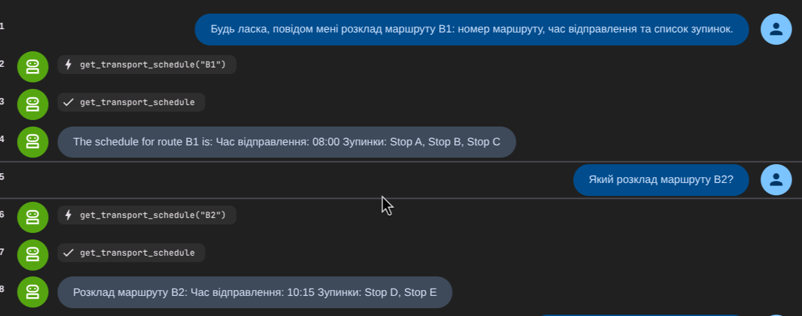
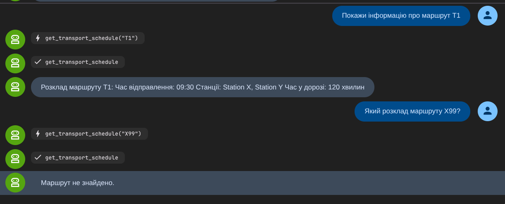

# Агент розкладу громадського транспорту
## Варіант 8

### Завдання
Реалізувати систему розкладу громадського транспорту з використанням AI агента (Google ADK).

#### OOP-завдання
Система повинна демонструвати всі 4 парадигми об'єктно-орієнтованого програмування:

1. **Абстракція** — Абстрактний клас `Transport` з:
   - Атрибутами: `route_number`, `departure: str`
   - Абстрактним методом: `get_schedule() -> dict`

2. **Наслідування** — Класи `Bus` та `Train` успадковують `Transport`:
   - `Bus`: додає `stops: list[str]` — список зупинок
   - `Train`: додає `stations: list[str]` та `travel_time_min: int`
   - Обидва реалізують `get_schedule()`

3. **Інкапсуляція** — Клас `Schedule`:
   - Приватний словник `__routes: dict[str, Transport]`
   - Методи: `add_route(transport)`, `find_route(route_number: str)`, `list_routes()`

4. **Поліморфізм** — Через різні реалізації `get_schedule()`:
   - `Bus.get_schedule()` повертає дані про зупинки
   - `Train.get_schedule()` повертає дані про станції та час у дорозі
   - `Schedule.list_routes()` використовує поліморфізм через `get_schedule()`

### Тестування

1. **Запит про маршрут автобуса B1**:
2. **Який розклад маршруту B2?**

2. **Запит про поїзд T1**:
3. **Запит про неіснуючий маршрут**:

