# Звіт до роботи
## Тема: Віртуальні середовища Python та керування залежностями
### Мета роботи: Опанувати venv, Pipenv та Poetry для ізоляції проєктів та керування бібліотеками.

---
### Виконання роботи

* **Основи роботи з PIP та бібліотеками:**
    1. Перевірили версію `pip -V` та доступні команди через `pip --help`.
    2. Встановили бібліотеку `requests`, перевірили її версію та статус-код відповіді (200 OK) від google.com.
    3. Протестували керування версіями: встановлення `requests==2.1`, перегляд через `show` та видалення через `uninstall`.

    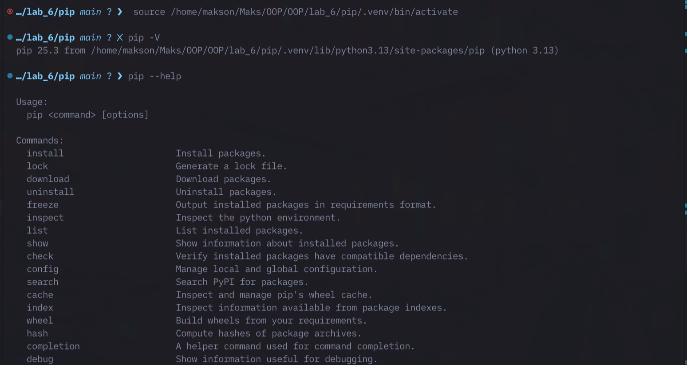
    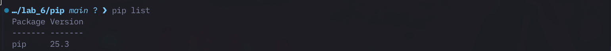
    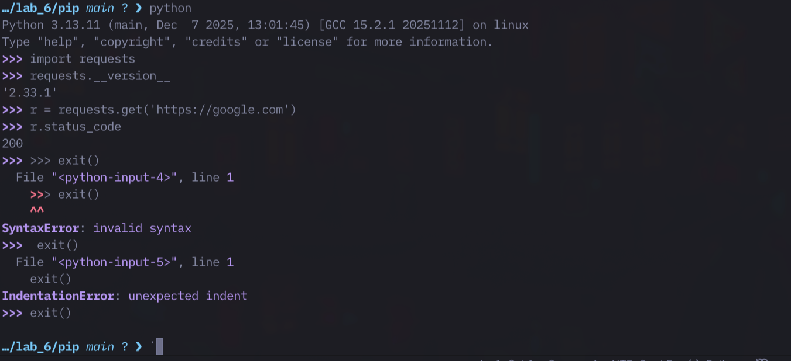
    *(Місце для твого скріна виводу pip list)*

* **Робота з API (Anime Project):**
    1. Інсталювали `jikanpy-v4` та `Flask`.
    2. Створили файл `anime.py`, який через Jikan API отримує дані про епізоди аніме та виводить їх на локальну веб-сторінку.
    
    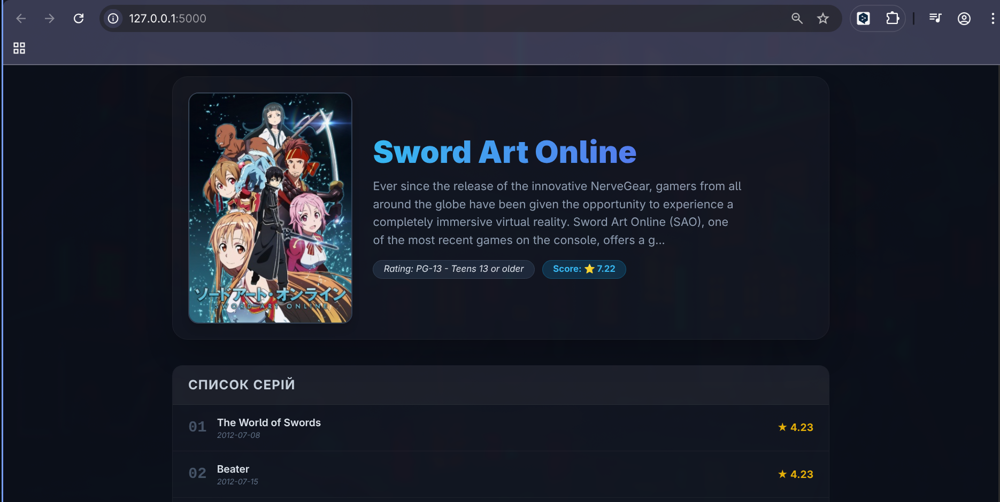
    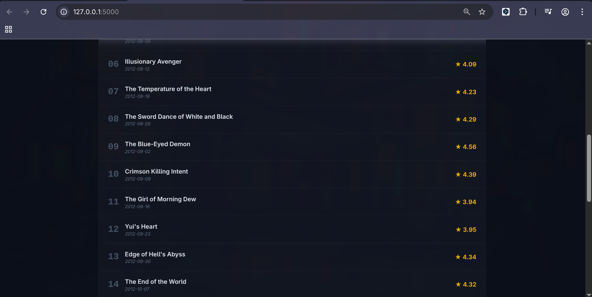

* **Віртуальні середовища (venv):**
    1. Створили ізольоване середовище: `python -m venv ./my_env`.
    2. Після активації (`source`) встановили бібліотеки, які не доступні глобально.
    3. У файл `.gitignore` додали папки `my_env/`, `.venv/` та `__pycache__/`, щоб не засмічувати репозиторій.

* **Керування через Pipenv:**
    1. Створили середовище та переконалися у створенні `Pipfile` (конфігурація) та `Pipfile.lock` (фіксація версій).
    2. Використали `pipenv graph` для візуалізації дерева залежностей.
    3. Провели перевірку коду лінтером `flake8` та аудит безпеки через `pipenv check`.
    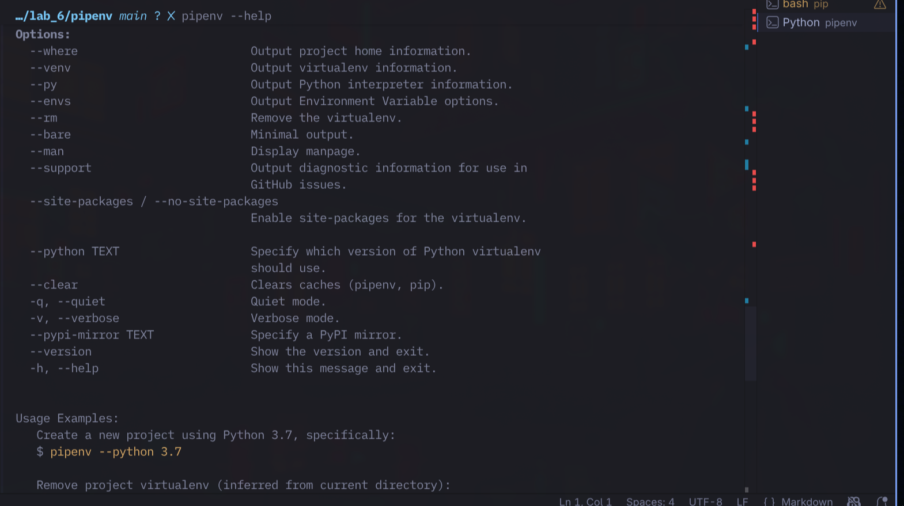
    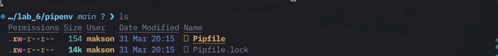
    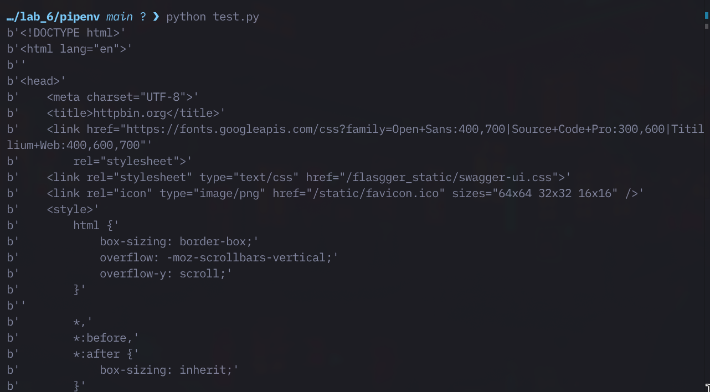
    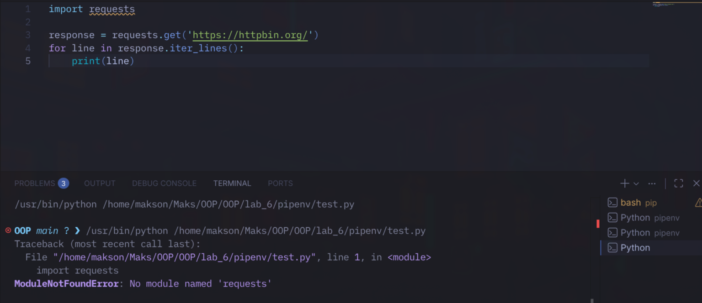
    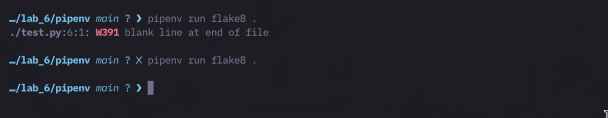
* **Робота з Poetry:**
    1. Ініціалізували проєкт `poetry new myproject`.
    2. Додали залежності через `poetry add`. Вивчили структуру `pyproject.toml`.
    3. Навчилися запускати скрипти без прямої активації оболонки через `poetry run`.

    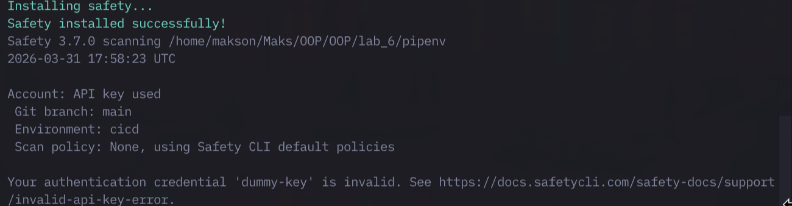
    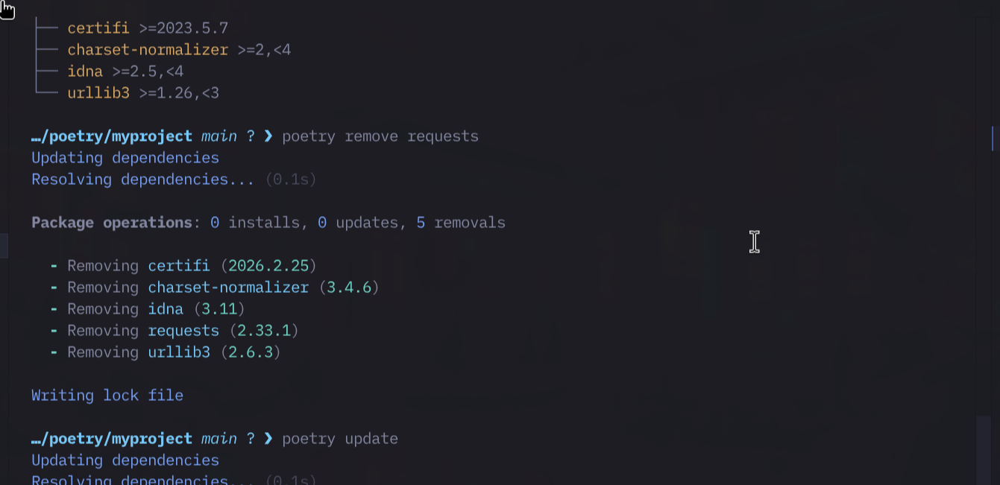
    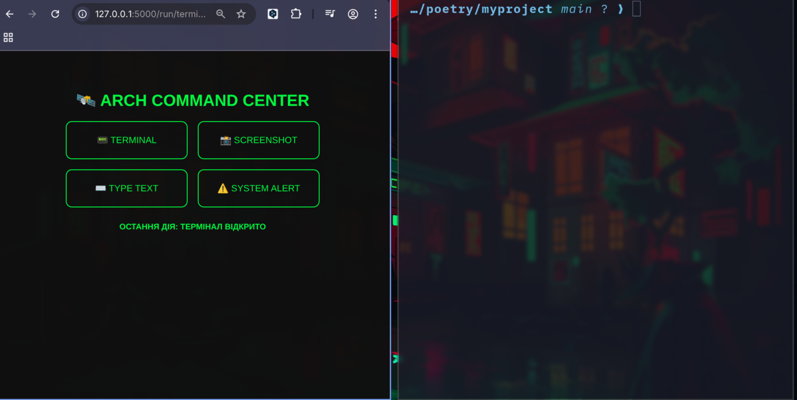
    

