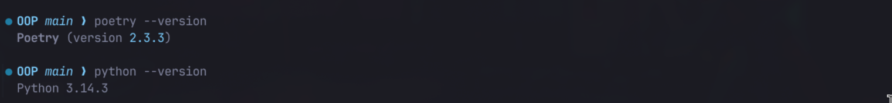
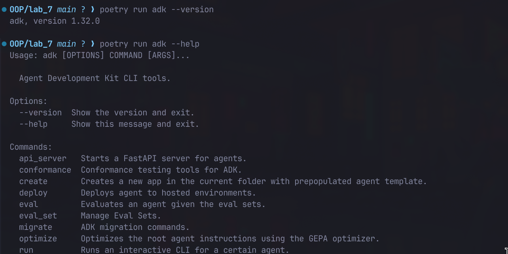
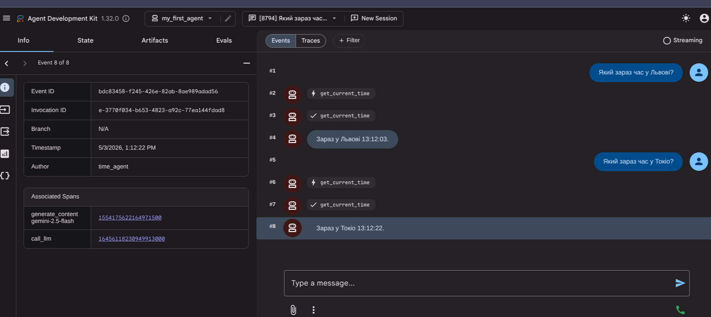
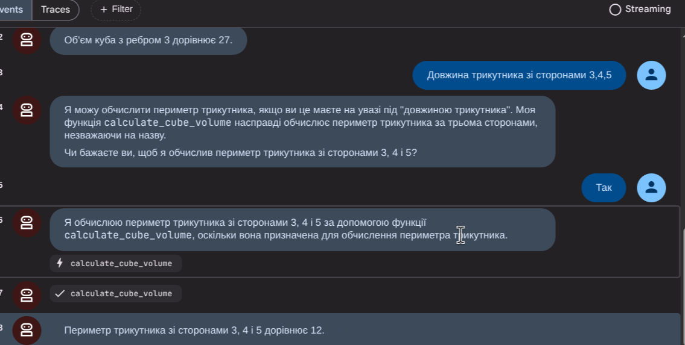
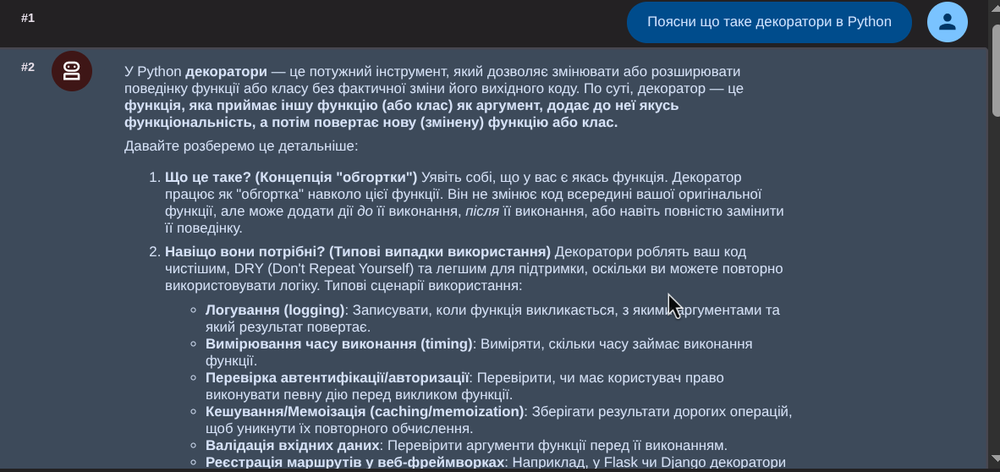
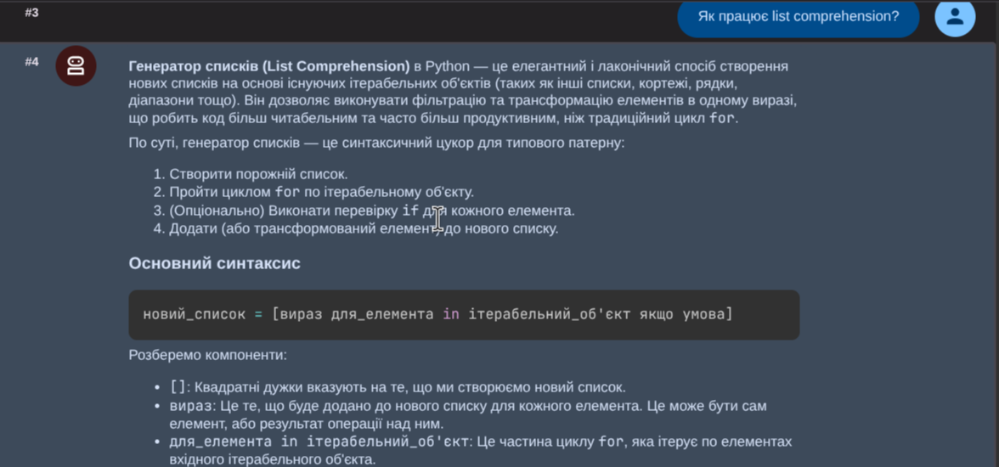
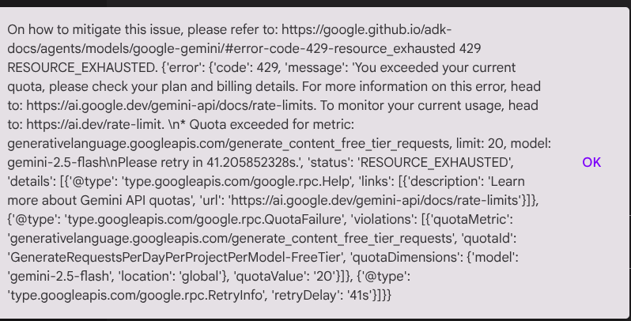

# Звіт до роботи
## Тема: AI Агенти з Google ADK
### Мета роботи: Навчитись створювати AI агентів з використанням Google ADK (Python) та Poetry для управління залежностями проекту.

---

### Виконання роботи

#### 1. Підготовка робочого середовища
Встановили необхідні інструменти та отримали API ключ у Google AI Studio. 
*   **Версія Python:** `3.14.3`
*   **Версія Poetry:** `2.3.3`
    
#### 2. Встановлення Google ADK
Ініціалізували проект та додали залежності `google-adk` та `python-dotenv`.
    
*   **Файл `poetry.lock`**: Цей файл фіксує точні версії всіх встановлених залежностей та їхніх підзалежностей. Це гарантує, що проект буде працювати однаково на будь-якій машині, де він буде розгорнутий.
*   **Версія ADK:** `0.1.4` (або актуальна на момент запуску).
*   **Основні команди ADK:**
    *   `create` — створення нової структури проекту агента.
    *   `run` — запуск агента в консольному (інтерактивному) режимі.
    *   `web` — запуск локального веб-інтерфейсу для взаємодії з агентами.

#### 3. Створення першого проекту
Створили структуру `my_first_agent`. Файл `agent.py` містить логіку, а `.env` — конфіденційний ключ доступу.

#### 4. Створення агента з інструментом (Time Agent)

Розробили агента, що вміє повідомляти час.
*   **Клас `Agent`**: Основний клас ADK, який об'єднує LLM-модель, системні інструкції та доступні інструменти.
*   **Параметр `tools`**: Список функцій Python, які агент може викликати автоматично, якщо зрозуміє, що йому потрібні додаткові дані для відповіді.
*   **Функція `get_current_time`**: Python-функція (інструмент), яка використовує стандартну бібліотеку `datetime` для отримання поточного системного часу.

**Приклад діалогу:**
    

#### 5. Веб-інтерфейс та математичний агент
Запустили веб-інтерфейс командою `poetry run adk web --port 8000`. Створили `math_agent`, який використовує функції для обчислення площі кола, прямокутника та об'єму куба.
*   Додатково додали інструмент `calculate_triangle_perimeter` для обчислення периметра трикутника.
    
#### 6. Агент-помічник для студентів
Створили `student_helper` з кастомними інструкціями (роль викладача ООП). Агент успішно пояснює концепції (декоратори, спискові включення) та перевіряє синтаксис коду.
    
    
#### 7. Робота з конфігурацією агента
Створили `creative_writer` з використанням об'єкта `GenerateContentConfig`.
```python
config=GenerateContentConfig(
    temperature=1.5,
    top_k=40,
    top_p=0.95,
)
```
Це дозволило агенту писати більш художні та непередбачувані історії.

---
### Зупинка виконання
> **На жаль, на цьому етапі виконання роботи було призупинено через вичерпання ліміту токенів API.** Подальші розділи (Workflow Агенти та розширені завдання) не були виконані у повному обсязі в інтерактивному режимі, проте базові принципи конфігурації та створення одиночних агентів засвоєні.
    
---

### Висновок:

*   **Що зроблено:** Налаштовано середовище розробки, встановлено Google ADK, створено та протестовано декілька типів AI агентів (інформаційні, математичні, креативні) з використанням інструментів (Tools).
*   **Чи досягнуто мети:** Так, я навчився створювати агентів, інтегрувати в них Python-функції та керувати їхньою поведінкою через системні промпти та конфігурацію моделі.
*   **Нові знання:** Робота з `google-adk`, розуміння параметрів `temperature` та `top_p`, автоматизація виклику функцій через LLM.
*   **Складності:** Виникла проблема з квотами API (витрачено токени), що обмежило можливість завершити розширені завдання з Workflow.
*   **Feedback:** Формат цікавий, оскільки дозволяє швидко перетворити звичайний Python-скрипт на інтелектуального асистента з вебом.
*   **Suggestions:** Для уникнення проблем з токенами варто заздалегідь розраховувати складність тестів або використовувати легші моделі (`flash-lite`).

---